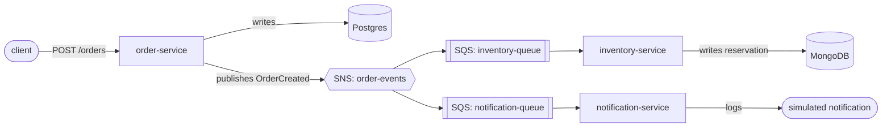

# Order Processing Platform

[](https://github.com/sahilkalgutkar/order-processing-platform/actions/workflows/ci.yml)
[](https://codecov.io/gh/sahilkalgutkar/order-processing-platform)
[](codecov.yml)
[](LICENSE)

I built a small event-driven microservices system in Go as a portfolio piece
demonstrating production backend patterns: a REST API backed by Postgres,
event publish/fan-out via SNS→SQS, two independent consumers (one writing
to MongoDB, one simulating notifications), containerized with Docker,
deployable to AWS ECS Fargate via Terraform, with Prometheus metrics and
CI on every push.

## Architecture



- **order-service** — REST API (`POST /orders`, `GET /orders/{id}`). Validates
  and persists to Postgres, then publishes an `OrderCreated` event to SNS.
  Publish failure doesn't fail the request — the order is durable and the
  intended recovery path is a reconciliation job (not implemented here, called
  out as a known gap).
- **inventory-service** — long-polls its own SQS queue (subscribed to the SNS
  topic), applies a reservation rule (`internal/domain/reservation.go`), and
  writes the result to MongoDB.
- **notification-service** — long-polls a second, independent SQS queue
  subscribed to the same topic, and logs a simulated notification. This is
  the fan-out half of the demo: one event, two consumers, neither aware of
  the other.

Each service is its own Go module (`go.work` ties them together for local
tooling only) so they stay independently buildable and deployable, the way
they'd actually be deployed as separate ECS services.

## Why these choices (talking points)

- **Dependency inversion for testability** — `order-service`'s HTTP handler
  depends on `OrderStore`/`EventPublisher` interfaces it defines itself
  (`internal/api/http.go`), not on the concrete Postgres/SNS types. Handler
  tests (`internal/api/http_test.go`) run against in-memory fakes with zero
  network calls — see `TestCreateOrder_PublishFailureStillReturnsCreated`
  for the "save must succeed, publish is best-effort" behavior under test.
- **Domain logic isolated from transport/infra** — `domain.NewOrder` and
  `domain.Reserve` are pure functions, table-tested independently of
  HTTP/SQS/DB (`internal/domain/*_test.go`).
- **Raw SNS→SQS delivery** — subscriptions use `RawMessageDelivery=true`
  (see `scripts/localstack-init.sh` and the Terraform `messaging` module) so
  consumers unmarshal the event directly instead of unwrapping an SNS
  envelope first.
- **At-least-once delivery, handled explicitly** — consumers only delete an
  SQS message after their write succeeds; a failed Mongo write leaves the
  message to become visible again and retry.
- **Contract duplication is intentional** — `OrderCreated` is defined
  separately in each service rather than imported from a shared package,
  so no service depends on another's internals. `proto/order/v1/order.proto`
  is the intended long-term source of truth for this contract.

## What's deliberately out of scope (and why)

- **gRPC isn't wired up yet.** The `.proto` contract exists
  (`proto/order/v1/order.proto`) mirroring the REST API, but this repo
  doesn't vendor `protoc`/`buf` codegen output. Documented as the natural
  next step — REST is fully functional without it.
- **No shared stock table** — `inventory-service` uses a `FixedStock` stand-in
  (`internal/consumer/sqs.go`) instead of a real inventory datastore, so the
  reservation *decision logic* is the thing under test, not a second CRUD
  service.
- **Terraform is a reference implementation**, not applied anywhere — it
  assumes an existing VPC/ALB/ECR and wires an ECS Fargate service +
  SNS/SQS + least-privilege IAM per service. `terraform validate` hasn't
  been run in this environment (no Terraform CLI installed here).
- **No distributed tracing yet** — Prometheus metrics are wired
  (`/metrics` on every service, scraped by the bundled Prometheus), but
  OpenTelemetry trace propagation across the SNS/SQS boundary is a
  reasonable "what would you add next" answer, not implemented.

## Running it locally

Requires Docker and Docker Compose.

```bash
make up
```

This builds and starts: Postgres, MongoDB, LocalStack (emulating SNS/SQS),
all three Go services, Prometheus, and Grafana. LocalStack auto-creates the
`order-events` topic and both queues on startup
(`scripts/localstack-init.sh`).

Create an order:

```bash
curl -s -X POST http://localhost:8080/orders \
  -H "Content-Type: application/json" \
  -d '{"customer_id":"cust-1","item_sku":"sku-1","quantity":2}'
```

Then check it fanned out:

```bash
docker compose logs inventory-service | grep "reservation processed"
docker compose logs notification-service | grep "notification sent"
```

Other useful ports once `make up` is running:

| Service          | URL                          |
|------------------|-------------------------------|
| order-service    | http://localhost:8080         |
| inventory-service| http://localhost:8081/healthz |
| notification-service | http://localhost:8082/healthz |
| Prometheus       | http://localhost:9090         |
| Grafana          | http://localhost:3000 (admin/admin) |

Tear down with `make down`.

## Development

```bash
make build   # go build for all three services
make test    # go test for all three services
make lint    # go vet for all three services
make tidy    # go mod tidy for all three services
```

All three services build, vet clean, and pass their test suites as of the
last commit — verified locally, not just asserted.

## Repo layout

```
services/
  order-service/       REST API, Postgres, SNS publisher
  inventory-service/    SQS consumer, reservation logic, MongoDB
  notification-service/ SQS consumer, simulated notifications
proto/                 gRPC contract (not yet code-generated — see above)
terraform/
  modules/ecs-service/  Reusable Fargate service module
  modules/messaging/     SNS topic + SQS queues + subscriptions
  envs/dev/               Wires the two modules together + least-privilege IAM
deploy/                 Prometheus scrape config
scripts/                LocalStack topic/queue bootstrap
.github/workflows/ci.yml  Per-service build/vet/test matrix + docker build
```

## Mapping to a "Golang backend, AWS, distributed systems" job description

| JD ask | Where |
|---|---|
| Design/build/maintain scalable Golang services | Three independently deployable Go services, each with a thin transport layer over testable domain logic |
| AWS ECS, Lambda-shaped deployment, SNS, SQS | `terraform/modules/ecs-service`, `terraform/modules/messaging`; SNS→SQS fan-out is the core integration pattern |
| Containerisation | Multi-stage Dockerfiles per service, `docker-compose.yml` for local dev |
| CI/CD automation | `.github/workflows/ci.yml` — per-service matrix build/vet/test + docker build |
| REST, GraphQL and/or gRPC | REST implemented; gRPC contract defined and documented as a concrete next step |
| Postgres and/or MongoDB | order-service → Postgres, inventory-service → MongoDB |
| Testing, reliability, maintainability | Table-driven domain tests, handler tests against fakes (no real infra needed), at-least-once SQS handling, graceful shutdown on SIGTERM in all three services |
| Ownership from design through production | README documents the tradeoffs and explicitly calls out what's not done and why, rather than presenting an idealized finished system |

## Suggested next steps (if extending this before/for the interview)

1. Generate the gRPC server from `proto/order/v1/order.proto` via `buf`,
   serve it alongside REST with `grpc-gateway`.
2. Add `testcontainers-go` integration tests for the Postgres and Mongo
   repositories (currently only unit-tested via interfaces/fakes).
3. Wire OpenTelemetry trace context through the SNS message attributes so
   a trace spans order-service → inventory-service/notification-service.
4. Add a reconciliation job for orders whose SNS publish failed
   (`order-service` logs but doesn't retry today).
5. Load test with `k6` or `vegeta` against `POST /orders` and publish the
   results — gives you real p50/p99 numbers to put in interview talking
   points or on the resume.
